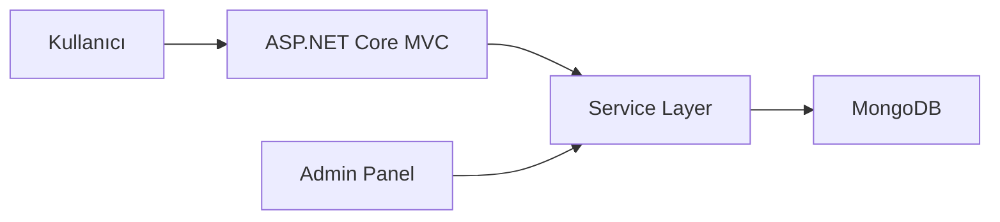
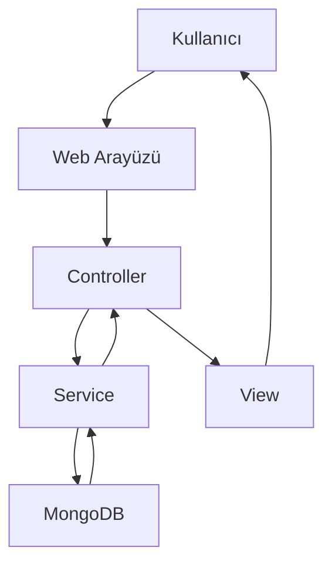
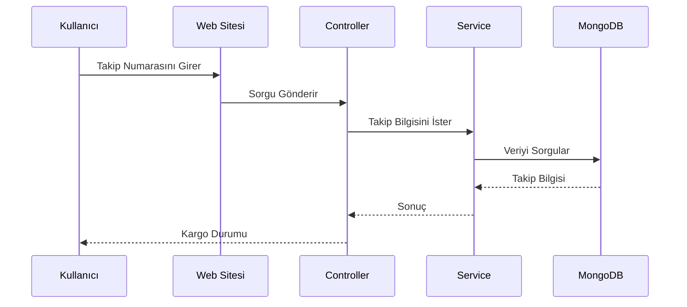

# 🚚 DatabaseMastery Transport

<p align="center">


</p>

---

# 📌 Proje Hakkında

**DatabaseMastery Transport**, ASP.NET Core MVC (.NET 6) ve MongoDB kullanılarak geliştirilmiş modern bir lojistik ve taşımacılık yönetim platformudur.

Uygulama; lojistik firmalarının dijital dönüşüm süreçlerini desteklemek amacıyla geliştirilmiş olup hem kullanıcı tarafını hem de yönetim panelini tamamen dinamik olarak yönetebilecek şekilde tasarlanmıştır.

Yönetim paneli üzerinden sistem yöneticileri;

* Hizmetleri yönetebilir
* Marka içeriklerini düzenleyebilir
* Müşteri yorumlarını güncelleyebilir
* Kargo takip süreçlerini kontrol edebilir
* Sevkiyat bilgilerini yönetebilir
* İletişim mesajlarını görüntüleyebilir
* Sık Sorulan Sorular bölümünü düzenleyebilir
* Ana sayfadaki tüm içerikleri dinamik olarak değiştirebilir

---

# 🚀 Öne Çıkan Özellikler

✅ Dinamik Admin Paneli

✅ MongoDB tabanlı veri yönetimi

✅ Kargo Takip Sistemi

✅ Sevkiyat Yönetimi

✅ Hizmet Yönetimi

✅ Referans ve Marka Yönetimi

✅ Slider Yönetimi

✅ Hakkımızda Yönetimi

✅ SSS Yönetimi

✅ İletişim Formu

✅ Responsive Tasarım

✅ Modern Dashboard

---

# 🛠 Kullanılan Teknolojiler

| Teknoloji            | Açıklama                  |
| -------------------- | ------------------------- |
| ASP.NET Core MVC     | Web uygulaması geliştirme |
| .NET 6               | Framework                 |
| C#                   | Backend                   |
| MongoDB              | NoSQL Veritabanı          |
| MongoDB Driver       | Database işlemleri        |
| AutoMapper           | Nesne dönüşümleri         |
| Dependency Injection | Bağımlılık yönetimi       |
| HTML5                | Arayüz                    |
| CSS3                 | Stil                      |
| Bootstrap 5          | Responsive Tasarım        |
| JavaScript           | Dinamik işlemler          |
| jQuery               | Frontend geliştirme       |

---

# 🏗 Kullanılan Yazılım Mimarisi

* MVC (Model View Controller)

* Service Layer Pattern

* DTO Pattern

* Dependency Injection

* AutoMapper

* Repository benzeri servis yapısı

* Clean Code prensipleri

---

# 📂 Proje Yapısı

```text
DatabaseMasteryTransport
│
├── Controllers
├── Models
├── DTOs
├── Services
├── Views
├── ViewComponents
├── Areas
│      └── Admin
├── wwwroot
├── MongoDB
└── Program.cs
```

# 📸 Proje Görselleri


---

# 🗄 Sistem Mimarisi



---

# 🔄 Genel İşleyiş



---

# 🚚 Kargo Takip Süreci



---

# 📦 Proje Modülleri

## 👨‍💼 Admin Paneli

* Slider Yönetimi
* Marka Yönetimi
* Hizmet Yönetimi
* Hakkımızda Yönetimi
* Referans Yönetimi
* İletişim Yönetimi
* SSS Yönetimi
* Sevkiyat Yönetimi
* Kargo Takip Yönetimi
* Dashboard
* İstatistik Sayfası

---

## 🌐 Kullanıcı Paneli

* Ana Sayfa

* Hizmetler

* Hakkımızda

* Markalar

* Referanslar

* SSS

* İletişim

* Kargo Takip

---

# ⚙ Kurulum

```bash
git clone https://github.com/yelda-batti0/DatabaseMasteryTransport.git
```

```bash
cd DatabaseMasteryTransport
```

MongoDB bağlantısını **appsettings.json** içerisinde düzenleyiniz.

Daha sonra projeyi çalıştırınız.

---


```text
README/
│
├── home.png
├── admin-dashboard.png
├── shipment.png
├── cargo-tracking.png
├── statistics.png
└── contact.png
```

---

# 🎯 Gelecekte Eklenebilecek Özellikler

* JWT Authentication
* Rol Bazlı Yetkilendirme
* Bildirim Sistemi
* Dashboard Grafikleri
* REST API
* SignalR ile Anlık Takip
* Docker Desteği
* Unit Test
* Logging
* Elasticsearch

---

# 📈 Proje Kazanımları

Bu proje geliştirilirken;

* ASP.NET Core MVC
* MongoDB
* Dependency Injection
* AutoMapper
* Katmanlı Mimari
* DTO Kullanımı
* CRUD İşlemleri
* Dinamik Admin Paneli
* Responsive Web Tasarımı
* Temiz Kod (Clean Code)

konularında uygulamalı deneyim kazanılmıştır.

---

👨‍💻 Geliştirici
Yelda Battı

GitHub: https://github.com/yelda-batti0

LinkedIn: www.linkedin.com/in/yelda-battı-8492b437a

⭐ Projeyi inceleyebilir, geri bildirimlerinizi paylaşabilir ve repo'ya yıldız verebilirsiniz.
